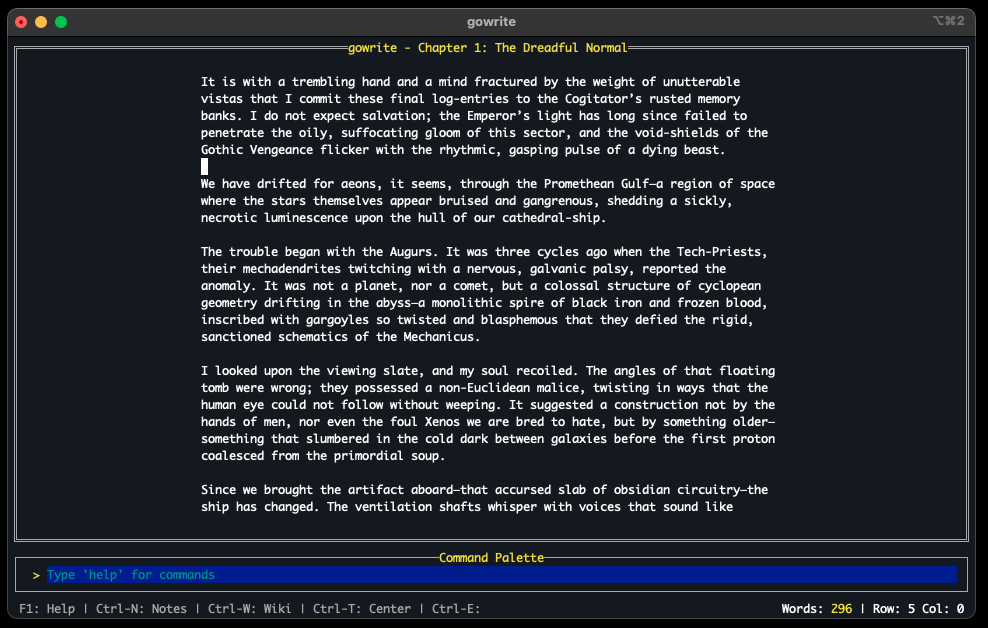

# gowrite



**gowrite** is a distraction-free, terminal-based manuscript editor written in Go.

It combines the minimalism of a text editor (like Vim/Nano) with the project-management features of writing software (like Scrivener/Hemingway), allowing authors to draft novels, organize chapters, and analyze their prose without ever touching a mouse.

## ✨ Key Features

* **Focused Drafting**: A clean, terminal-based interface designed for flow.
* **Dual-Pane Workflow**: Toggle instantly between your **Manuscript** and **Scene Notes** (`Ctrl-N`).
* **Hemingway Analysis**: A built-in style checker that highlights adverbs, passive voice, and overly complex sentences.
* **Zen & Comfort**:
    * **Center View (`Ctrl-T`)**: Toggles margins to reduce eye strain on wide monitors.
    * **Theming**: Switch between `dark`, `light`, or `retro` (green-screen) modes.
* **Story Wiki**: A dedicated global notebook for tracking characters, locations, and lore (`Ctrl+W`).
* **Structure Template**: Beat "blank page syndrome" by generating outline based on classic storytelling arcs (Hero's Journey, Save the Cat, Horror etc.) - 5 to pick from.
* **Project Management**: Reorder chapters, track word count targets, and auto-save safely to JSON.

## 🚀 Installation

### Prerequisites
* [Go](https://go.dev/dl/) (version 1.18 or higher recommended).

### Setup
Clone this repository.

### Running the App
```bash
go run main.go
```
*Or build for portability:*
```bash
go build -o gowrite main.go
./gowrite
```

## ⌨️ Shortcuts & Controls

| Global Key | Action |
| :--- | :--- |
| **Ctrl + E** | **Open Command Palette** (Type commands here) |
| **Ctrl + N** | Toggle **Scene Notes** View |
| **Ctrl + W** | Toggle **Story Wiki** View |
| **Ctrl + T** | Toggle **Center Column** View (Margins) |
| **Ctrl + F** | Toggle **Focus Mode** (Hide UI) |
| **Ctrl + G** | Opens Chapter Modal |
| **Ctrl + S** | Quick Save |
| **F1** | Help Menu |
| **Esc** | Exit current view (Analysis/Help) back to Editor |

### Text Editing
Standard readline shortcuts apply:
* **Ctrl+Q / Ctrl+V**: Copy / Paste
* **Ctrl+Z / Ctrl+Y**: Undo / Redo
* **Arrows**: Navigation

## 🛠 Command Palette Guide
Press `Ctrl+E` to focus the command bar at the bottom.

### 1. File & Project
* `save [name]` — Save project to JSON (e.g., `save mybook`).
* `open` — Opens a file picker showing all `.json` files in the current directory. Use arrow keys to navigate and Enter to open.
* `open [name]` — Load a specific project file directly.
* `export [name]` — Export the full manuscript to a `.txt` file (excludes notes).

### 2. Chapters
* `chapter new [Title]` — Create a new chapter.
* `chapter rename [N] [Name]` — Rename chapter number `N`.
* `chapter delete [N]` — Delete chapter number `N`.
* `chapters` — Open the **Chapter Manager**.
    * *Inside Manager:* Use `<` and `>` to reorder chapters.
    
### 3. Story Wiki
* `wiki` — Toggle the Story Wiki.
* `wiki new [Name]` — Create new Entry 
* `wiki rename [Name]` — Rename the currently selected entry.
* `wiki delete` — Delete the currently selected entry.

### 4. Writing Tools
* `target [N]` — Set a word count goal for the current chapter.
* `wordcount` — Show stats (Words, Chars, Lines).
* `spellcheck` — Scan for words not in your `dictionary.txt`.
* `analyze` — **Hemingway Mode**. Switches to a read-only view that highlights:
    * **[Blue]**: Adverbs (weak verbs).
    * **[Green]**: Passive voice.
    * **[Yellow]**: Hard sentences (>14 words).
    * **[Red]**: Very hard sentences (>20 words).
    
### 5. Structuring & Plotting
* `structure [type]` — WARNING: Replaces all current chapters with a template structure.
    * 3act - Standard Three-Act structure
    * hero - The Hero's Journey (Monomyth)
    * cat - Save the Cat (Screenwriting/Pacing beat sheet)
    * fichtean - Fichtean Curve (Series of crises, great for thrillers)
    * horror - 7-beat Horror/Survival arc.

### 6. Customization
* `theme [name]` — Change color scheme.
    * Options: `dark` (Default), `light`, `retro`.
* `search [term]` / `replace [old] [new]` — Standard find/replace.

## 📂 Data Structure
Your project saves as a single `.json` file containing the manuscript and the meta-data (notes, targets).

**Example `mybook.json`:**
```json
{
  "Chapters": [
    {
      "Title": "Chapter 1: The Call",
      "Content": "The phone rang at midnight...",
      "Notes": "Foreshadow the villain.",
      "Target": 1500
    }
  ],
  "Wiki": [
    {
      "Title": "Main Character",
      "Content": "Name: John Doe\nAge: 35"
    }
  ]
}
```

## License
This project is licensed under the GNU General Public License v3.0 (GPLv3).
