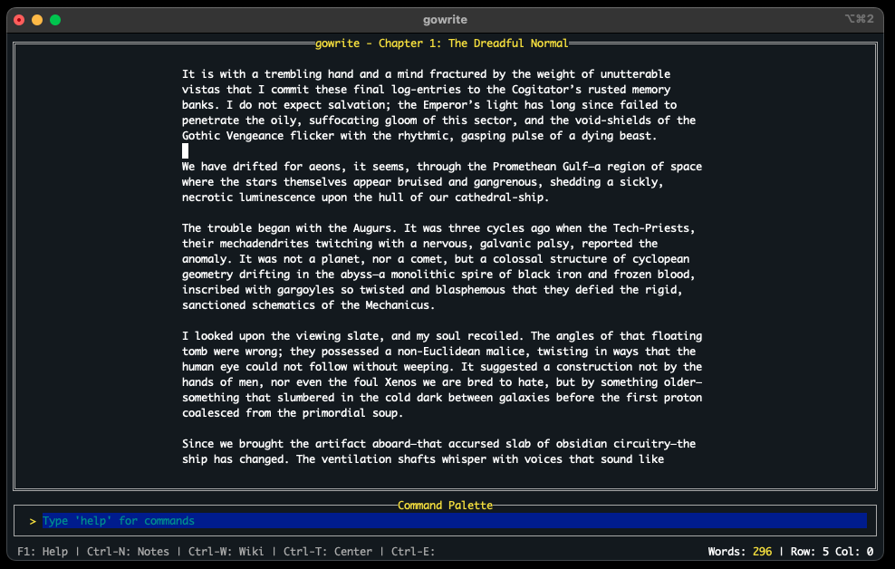

gowrite
======




**Overview**: gowrite is a terminal-based writing tool providing a simple editor, scene notes, a story wiki, structure templates, basic spell-check (using `dictionary.txt`), and a Hemingway-style analysis view.

**Version**: 0.23 — early development (still in active development; expect changes and rough edges).

**License**: Released under the GNU Public License.

**Features**:
- TUI editor with chapter support and per-chapter notes
- Story Wiki (separate entries)
- Structure templates (3-act, Hero/Monomyth, Save the Cat, Fichtean, Horror)
- Hemingway-style analysis (adverbs, passive voice, long sentences)
- Spell check using `dictionary.txt`
- Autosave and JSON project save/load; export to plain text

**Requirements**:
- Go (1.18+ recommended)
- The project uses external modules (tcell, tview). Dependencies are managed by `go.mod`.

**Build**:
```bash
go build -o gowrite ./gowrite
```

**Run (development)**:
```bash
go run ./gowrite
```

**Quick usage notes**:
- Commands are entered via the command palette (Ctrl-E) such commands: `save`, `open`, `export`, `spellcheck`, `analyze`, `structure <type>`, `chapter new`, `wiki new`, etc.
- F1 or `help` in command palette for comprehensive help.
- Files are saved/loaded as JSON (projects include chapters + wiki). Import supports plain `.txt` files for chapters.
- Spell check requires a `dictionary.txt` file in the working directory.

